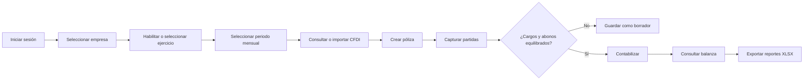
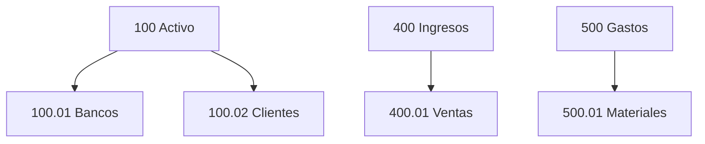
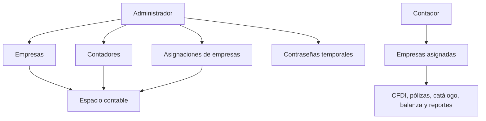
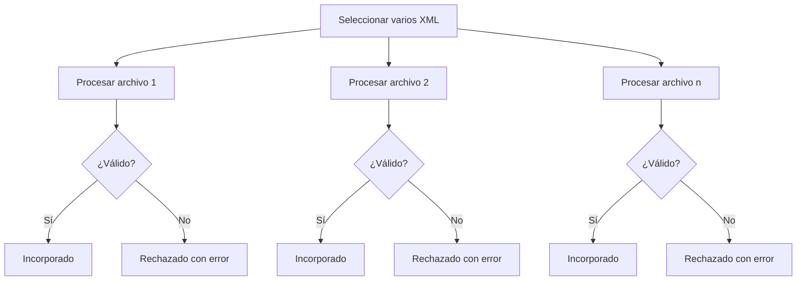
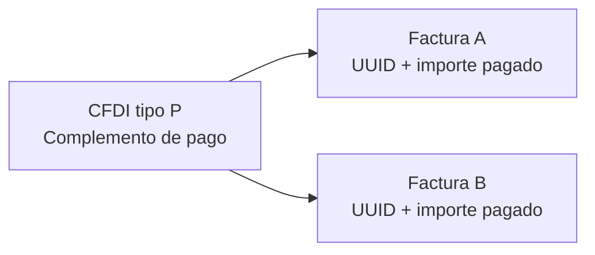
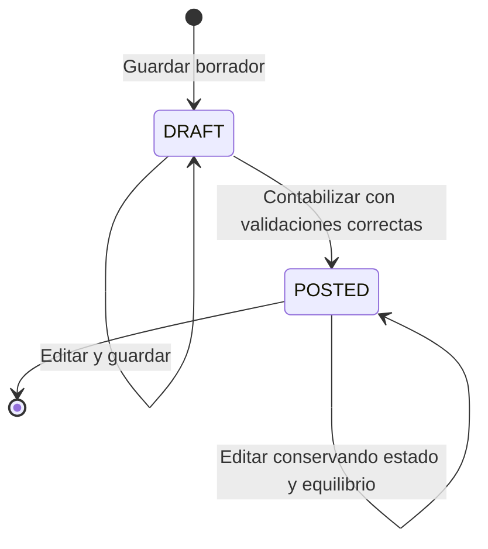
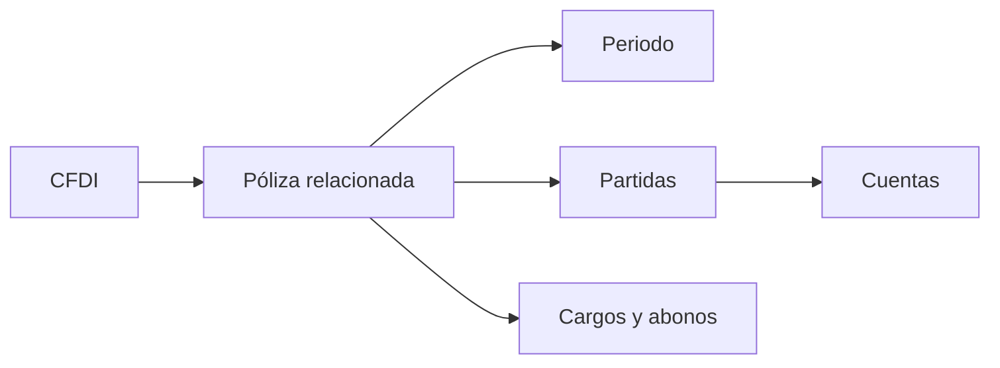

# Manual de uso del sistema contable

**Audiencia:** administradores y contadores

**Estado:** guía funcional de la versión actual

**Última actualización:** 2026-09-08

## 1. Propósito de este manual

Este documento explica cómo utilizar la aplicación web, qué acciones están disponibles en cada módulo, qué información se espera capturar y qué validaciones pueden aparecer.

El manual describe el comportamiento actual de la interfaz y del sistema. No sustituye la asesoría contable, fiscal o legal. En particular, una validación de estructura de RFC no confirma por sí misma la situación fiscal ante el SAT.

Para explicar los conceptos contables con más detalle se puede consultar el [glosario de contabilidad](planeacion/Conceptos/Gu%C3%ADa%20de%20conceptos.md), el [glosario del dominio](planeacion/002%20-%20Glosario.md) y los [escenarios contables](planeacion/004%20-%20Escenarios%20contables.md).

## 2. Cómo funciona el sistema en general

El flujo principal de trabajo es:



La regla de contexto más importante es:

> Toda operación pertenece a una empresa y, cuando corresponde a una póliza, a un periodo contable específico.

En la pantalla de empresas se selecciona la empresa activa. Después se selecciona el año y el mes. El encabezado de la aplicación muestra el contexto activo cuando ya existe una selección:

```text
Empresa / Mes Año / Abierto o Cerrado
```

Antes de registrar una póliza o consultar CFDI, balanza y reportes, verifica que la empresa y el periodo sean los correctos.

## 3. Conceptos básicos

### Empresa

Es la entidad cuyos datos contables se administran. Cada empresa tiene su propio:

- RFC y razón social;
- régimen fiscal;
- catálogo de cuentas;
- ejercicio y periodos;
- conjunto de CFDI;
- conjunto de pólizas y movimientos.

Los datos de una empresa no deben mezclarse con los de otra.

### RFC

Identificador fiscal de la empresa. En el sistema se guarda en mayúsculas y se valida que tenga una estructura de 12 o 13 caracteres. El RFC debe ser único entre las empresas registradas.

### Régimen fiscal

Clave y nombre del régimen fiscal seleccionado desde un catálogo versionado. El catálogo se presenta en el formulario de creación de empresa; no se captura libremente una clave que no exista en él.

### Ejercicio y periodo

- **Ejercicio:** año contable, por ejemplo `2026`.
- **Periodo:** mes dentro del ejercicio, por ejemplo `Julio 2026`.

Al habilitar un ejercicio se crean sus doce meses. Cada periodo muestra uno de estos estados:

- **Abierto:** disponible como contexto operativo.
- **Cerrado:** visible y seleccionable para consulta.

### Catálogo de cuentas

Es la lista jerárquica de cuentas que utiliza una empresa. Puede tener cuentas agrupadoras y cuentas auxiliares:



- Una **cuenta padre** agrupa cuentas descendientes.
- Una cuenta que no acepta movimientos funciona como agrupadora.
- Una cuenta que acepta movimientos puede seleccionarse en las partidas de una póliza.
- Una cuenta debe estar activa y aceptar movimientos para poder utilizarse en una póliza.

### Naturaleza de la cuenta

La naturaleza indica cómo se interpreta el saldo de una cuenta:

- **Deudora:** normalmente aumenta con cargos.
- **Acreedora:** normalmente aumenta con abonos.

Esto no significa que cargo sea siempre una entrada de dinero ni que abono sea siempre una salida. El significado depende de la cuenta y de la operación.

### Cargo, abono y partida

- **Cargo:** importe registrado en el lado deudor de una partida.
- **Abono:** importe registrado en el lado acreedor de una partida.
- **Partida:** una línea dentro de una póliza, con una cuenta y un cargo o abono.

En una póliza contabilizada debe cumplirse:

```text
Total de cargos = Total de abonos
```

### Póliza

Es el conjunto de partidas que representa una operación contable. En el sistema puede ser de tipo:

- **Ingreso:** registra una operación de ingreso.
- **Egreso:** registra una salida, compra o gasto.
- **Diario:** registra ajustes, reclasificaciones u otras operaciones.

Una póliza puede existir sin CFDI, porque no todos los movimientos contables dependen de un documento fiscal. También puede relacionarse con uno o varios CFDI.

### CFDI

Es el comprobante fiscal importado desde un archivo XML. La interfaz contempla documentos de tipo:

- `I`: ingreso;
- `E`: egreso;
- `P`: pago.

La dirección se determina respecto a la empresa activa:

- **Emitido:** la empresa es el emisor del CFDI.
- **Recibido:** la empresa es el receptor del CFDI.

### PUE, PPD y complemento de pago

- **PUE:** pago en una sola exhibición, de acuerdo con el dato del CFDI.
- **PPD:** pago en parcialidades o diferido. La factura puede registrarse antes de que exista el pago.
- **Complemento de pago:** CFDI tipo `P` que puede relacionarse con una o varias facturas mediante UUID e importe pagado.

Actualmente el sistema conserva las relaciones documentales y muestra los importes asignados, pero no calcula un saldo PPD ni determina por sí solo que una factura esté liquidada.

### Borrador y contabilizada

- **Borrador:** puede estar incompleto o descuadrado y todavía no afecta la balanza.
- **Contabilizada:** debe cumplir las validaciones de partida doble y sí afecta la balanza.

Un CFDI se muestra como **Contabilizado** cuando tiene al menos una póliza relacionada en estado contabilizado. Esto no significa necesariamente que el CFDI esté pagado o liquidado.

## 4. Roles y permisos



| Rol | Puede hacer | Restricción principal |
| --- | --- | --- |
| Administrador | Ver todas las empresas, crear empresas, crear contadores, asignar empresas y restablecer contraseñas | No se crean administradores adicionales desde la interfaz web |
| Contador | Trabajar con CFDI, catálogo, pólizas, balanza y reportes | Solo puede ver y operar las empresas que el administrador le asignó |

La asignación de una empresa se aplica inmediatamente. Si se retira una asignación, el contador deja de verla y no puede consultar sus datos.

## 5. Acceso y seguridad

### 5.1 Iniciar sesión

1. Abre la pantalla de inicio de sesión.
2. Captura el correo proporcionado por el administrador.
3. Captura la contraseña.
4. Selecciona **Ingresar**.

El correo se normaliza quitando espacios al inicio y al final y convirtiéndolo a minúsculas.

Si las credenciales no son correctas, se muestra:

```text
Las credenciales no son correctas.
```

Después de demasiados intentos fallidos para la combinación de correo y dirección IP, se aplica una espera temporal de un minuto:

```text
Demasiados intentos. Inténtalo de nuevo en un minuto.
```

### 5.2 Contraseña temporal

Cuando el administrador crea un contador o restablece su contraseña:

1. El sistema genera una contraseña temporal.
2. El administrador debe copiarla y entregarla de forma segura.
3. La contraseña temporal solo se muestra en ese momento.
4. El contador puede iniciar sesión, pero debe cambiarla antes de consultar empresas.

Si existe un cambio pendiente, la aplicación dirige al contador a **Actualiza tu contraseña**.

### 5.3 Cambiar la contraseña

Captura:

- contraseña actual;
- nueva contraseña;
- confirmación de la nueva contraseña.

La nueva contraseña debe:

- tener entre 12 y 128 caracteres;
- coincidir con la confirmación;
- utilizar una contraseña actual correcta.

Después de guardar correctamente, el sistema permite continuar a la pantalla de empresas.

### 5.4 Cerrar sesión

Selecciona **Cerrar sesión** en la barra lateral. La sesión se invalida y la aplicación regresa a la pantalla de inicio.

## 6. Administración de empresas y contadores

### 6.1 Crear una empresa

Esta acción está disponible para el administrador.

1. Entra a **Empresas**.
2. Selecciona **Nueva empresa**.
3. Captura el RFC.
4. Captura la razón social.
5. Selecciona el régimen fiscal.
6. Selecciona **Crear empresa**.

Validaciones esperadas:

| Campo o situación | Resultado esperado |
| --- | --- |
| RFC vacío | Se solicita el RFC |
| RFC con estructura distinta de 12 o 13 caracteres | Se rechaza el RFC |
| RFC repetido | `Ya existe una empresa con este RFC.` |
| Razón social vacía | Se solicita la razón social |
| Régimen inexistente en el catálogo | Se rechaza la empresa |
| Espacios o minúsculas | Se normalizan antes de guardar |

Al terminar, la empresa aparece en el selector superior y puede seleccionarse para comenzar su configuración.

### 6.2 Crear un contador

1. Entra a **Contadores**.
2. Selecciona **Nuevo contador**.
3. Captura nombre y correo.
4. Selecciona **Crear contador**.
5. Copia la contraseña temporal que aparece en la ventana **Contador creado**.

El nombre es obligatorio y puede tener hasta 255 caracteres. El correo debe ser válido y no estar registrado previamente.

La contraseña temporal no se vuelve a mostrar. Si se pierde, utiliza **Restablecer contraseña**.

### 6.3 Asignar empresas

1. En **Contadores**, localiza al contador.
2. Selecciona **Asignar empresas**.
3. Marca las empresas que debe poder consultar.
4. Selecciona **Guardar asignaciones de ...**.

Las asignaciones reemplazan la lista anterior. Si no se marca ninguna empresa, el contador queda sin empresas asignadas.

### 6.4 Restablecer una contraseña

1. Localiza al contador.
2. Selecciona **Restablecer contraseña**.
3. Confirma la acción.
4. Copia la nueva contraseña temporal.

El restablecimiento cierra las sesiones existentes del contador y vuelve a exigir el cambio de contraseña.

## 7. Empresas, ejercicios y periodos

### 7.1 Seleccionar la empresa

1. En la barra superior, abre **Empresa activa**.
2. Selecciona una empresa.
3. Confirma el RFC que aparece junto al nombre.

Si no aparece una empresa, significa que no tienes acceso a ella o que todavía no ha sido creada.

### 7.2 Habilitar un ejercicio

1. Selecciona la empresa.
2. Selecciona **Habilitar ejercicio**.
3. Captura el año con cuatro dígitos, por ejemplo `2026`.
4. Selecciona **Habilitar**.

El resultado es la creación de enero a diciembre, todos inicialmente en estado **Abierto**.

Validaciones esperadas:

- el año es obligatorio;
- debe ser un número entero de cuatro dígitos;
- no puede habilitarse dos veces el mismo año para la misma empresa;
- la operación es completa: no se crean solo algunos meses.

### 7.3 Seleccionar un periodo

1. Selecciona el ejercicio en el control **Ejercicio**.
2. Selecciona un mes, por ejemplo **Jul Abierto**.
3. Verifica el texto **Contexto: Julio 2026**.

El periodo seleccionado se conserva como contexto recordado para facilitar el regreso a la misma empresa y mes.

Un periodo con estado **Cerrado** permanece visible y seleccionable para consulta. La versión actual no ofrece una acción web para cerrar periodos ni documenta todavía un flujo completo de bloqueo al cerrarlos; no debe asumirse que el estado mostrado sustituye una política formal de cierre.

### 7.4 Cambiar de contexto

Antes de crear una póliza o revisar un reporte:

1. Verifica la empresa en el selector superior.
2. Verifica el año.
3. Verifica el mes.
4. Revisa el indicador de estado.

Si el contexto guardado deja de ser válido, la aplicación lo elimina y solicita seleccionar nuevamente la empresa o el periodo.

## 8. Catálogo de cuentas

### 8.1 Crear una cuenta

1. Selecciona una empresa.
2. Abre la pestaña **Catálogo**.
3. Selecciona **Nueva cuenta**.
4. Captura el código.
5. Captura el nombre.
6. Selecciona la naturaleza: **Deudora** o **Acreedora**.
7. Selecciona una cuenta padre o deja **Sin cuenta padre**.
8. Define si **Acepta movimientos**.
9. Define si la cuenta está activa.
10. Selecciona **Crear cuenta**.

Recomendación funcional:

- Marca **Acepta movimientos** para cuentas que recibirán partidas.
- Déjalo desmarcado para cuentas agrupadoras que solo organizan el catálogo.
- Mantén activa una cuenta mientras deba poder seleccionarse en nuevas pólizas.

Validaciones esperadas:

- código obligatorio, máximo 64 caracteres y único dentro de la empresa;
- nombre obligatorio, máximo 255 caracteres;
- naturaleza `DEBIT` o `CREDIT`;
- cuenta padre perteneciente a la misma empresa;
- la jerarquía no puede crear ciclos;
- no se permite utilizar una cuenta inexistente como padre.

### 8.2 Editar o activar una cuenta

1. En la tabla del catálogo, localiza la cuenta.
2. Selecciona **Editar**.
3. Actualiza los campos permitidos.
4. Selecciona **Guardar cambios**.

Para cambiar el estado, selecciona **Desactivar** o **Activar**.

Una cuenta que ya tiene partidas conserva su estructura. No se puede cambiar:

- el código;
- la naturaleza;
- la cuenta padre.

Sí pueden cambiarse el nombre y el estado, siempre que se cumplan las demás validaciones.

Si una cuenta se desactiva, deja de aparecer como opción para nuevas partidas. Los movimientos históricos no se eliminan.

### 8.3 Buscar y filtrar

En **Catálogo** puedes:

- buscar por código o nombre en **Buscar código o nombre**;
- filtrar por **Todos los estados**, **Activas** o **Inactivas**;
- revisar la jerarquía mediante la indentación y el símbolo de cuenta descendiente.

Si no hay resultados, cambia la búsqueda o el filtro de estado.

### 8.4 Importar el catálogo mediante CSV

1. Abre **Catálogo**.
2. Selecciona **Importar CSV**.
3. Prepara un archivo CSV UTF-8 separado por comas.
4. Usa exactamente este encabezado:

```csv
code,name,nature,parent_code,accepts_entries,active
```

Ejemplo:

```csv
code,name,nature,parent_code,accepts_entries,active
100,Activo,DEBIT,,false,true
101,Bancos,DEBIT,100,true,true
400,Ingresos,CREDIT,,false,true
401,Ventas,CREDIT,400,true,true
```

5. Selecciona el archivo.
6. Selecciona **Importar CSV**.

Condiciones del archivo:

- debe ser CSV o TXT con formato CSV;
- debe pesar como máximo 2 MB;
- debe estar codificado en UTF-8;
- debe contener el encabezado exacto;
- cada fila debe tener seis columnas;
- `nature` debe ser `DEBIT` o `CREDIT`;
- `accepts_entries` y `active` deben ser `true` o `false`;
- `parent_code` puede quedar vacío;
- el código de la cuenta padre puede estar en la empresa o en el mismo archivo.

La importación es atómica. Si alguna fila tiene un error, no se guarda ninguna cuenta del archivo.

Errores comunes:

| Error | Causa o solución |
| --- | --- |
| `El archivo debe usar codificación UTF-8 válida.` | Guarda el CSV como UTF-8 |
| `El encabezado debe ser: code,name,nature,parent_code,accepts_entries,active.` | Corrige nombres, orden y cantidad de columnas |
| `La fila debe contener exactamente seis columnas.` | Revisa comas, comillas y campos incompletos |
| `El código está repetido` | Usa códigos únicos en el archivo |
| `El código ya existe en la empresa.` | No vuelvas a importar una cuenta existente |
| `La cuenta padre no existe en la empresa ni en el archivo.` | Agrega la cuenta padre o corrige `parent_code` |
| `La relación padre produciría un ciclo.` | Revisa la jerarquía de padres |
| `El valor debe ser true o false.` | Corrige los valores booleanos |
| `El archivo no contiene cuentas para importar.` | Agrega filas de cuentas |

## 9. Documentos fiscales y CFDI

### 9.1 Abrir la bandeja fiscal

1. Selecciona la empresa.
2. Selecciona el ejercicio y el periodo.
3. Abre la pestaña **Documentos fiscales**.

La bandeja muestra los CFDI cuyo `issued_at` pertenece al año y mes seleccionados. Si no hay periodo seleccionado, primero debes elegir uno.

### 9.2 Importar XML manualmente

1. Selecciona **Importar XML**.
2. Selecciona uno o varios archivos XML.
3. Confirma que sean CFDI 4.0 de tipo `I`, `E` o `P`.
4. Selecciona **Importar archivos**.

Límites de la operación:

- entre 1 y 50 XML por operación;
- máximo 10 MB por XML;
- los archivos deben tener formato XML;
- el RFC de la empresa debe participar como emisor o receptor;
- el UUID debe ser único dentro de la empresa.

La aplicación procesa cada archivo de manera independiente:



Por eso, un lote puede mostrar simultáneamente:

```text
3 importados; 1 rechazado.
```

Los XML válidos se conservan aunque otro archivo falle. Un CFDI repetido no genera un segundo registro y muestra un rechazo como:

```text
El CFDI ya existe para esta empresa.
```

### 9.3 Descargar documentos mediante la acción simulada

La bandeja incluye **Descarga simulada** para representar el flujo futuro de consulta de documentos externos.

1. Selecciona una empresa y un periodo.
2. Abre **Documentos fiscales**.
3. Selecciona **Descarga simulada**.
4. Espera el resumen del proceso.
5. Revisa cuántos documentos fueron encontrados, incorporados o rechazados.
6. Si el servicio simulado falla, selecciona **Reintentar descarga**.

Esta acción no consulta el SAT. No utiliza certificados, credenciales ni una conexión fiscal real. Su propósito actual es probar la experiencia del flujo de descarga e incorporación.

### 9.4 Consultar y filtrar CFDI

La tabla muestra:

- fecha;
- tipo y dirección: emitido o recibido;
- RFC relevante;
- UUID;
- método de pago;
- importe total;
- estado: **Contabilizado** o **Pendiente**.

Puedes:

- buscar por UUID o RFC en **Buscar CFDI**;
- filtrar con **Todos**, **Emitidos** o **Recibidos**;
- seleccionar **Ver detalle**.

### 9.5 Consultar el detalle del CFDI

En **Ver detalle** se muestran, entre otros datos:

- UUID, fecha, serie y folio;
- RFC y nombre del emisor y receptor;
- método y forma de pago;
- moneda y tipo de cambio;
- subtotal, impuestos y total;
- detalle de impuestos;
- complementos de pago relacionados;
- facturas relacionadas desde un CFDI tipo `P`;
- trazabilidad de pólizas, partidas, cuentas y periodos.

El CFDI puede mostrar **Pendiente** aunque ya exista en la bandeja. Cambia a **Contabilizado** cuando tenga una póliza relacionada que esté contabilizada.

### 9.6 Complementos de pago

Un CFDI tipo `P` puede mostrar varias facturas relacionadas, cada una con su UUID e importe asignado:



Si la factura relacionada todavía no se ha importado, la relación conserva el UUID y muestra:

```text
Factura aún no importada en esta empresa.
```

Cuando la factura se importa posteriormente, el sistema puede resolver la relación automáticamente si pertenece a la misma empresa.

El sistema no calcula actualmente saldo pendiente, sobrepagos, diferencias ni liquidación PPD.

### 9.7 Conservación del XML original

Al importar correctamente un CFDI, el XML original se conserva para trazabilidad dentro del sistema. La versión actual de la interfaz no muestra un botón visible de **Descargar XML original** desde el detalle.

## 10. Pólizas contables

### 10.1 Crear una póliza

1. Selecciona empresa, ejercicio y periodo.
2. Abre la pestaña **Pólizas**.
3. Selecciona **Nueva póliza**.
4. Selecciona el tipo: **Ingreso**, **Egreso** o **Diario**.
5. Captura la fecha.
6. Captura el concepto general.
7. Agrega las partidas.
8. Selecciona una cuenta para cada partida.
9. Captura el concepto y referencia de cada partida si son necesarios.
10. Captura el importe en **Cargo** o en **Abono**.
11. Selecciona los CFDI relacionados, si aplica.
12. Guarda como borrador o contabiliza.

El folio se genera automáticamente. El número se controla por tipo de póliza dentro del periodo; el campo **Folio** aparece como **Automático** mientras se crea una nueva póliza.

### 10.2 Capturar partidas

Selecciona **+ Agregar partida** para insertar una línea y usa `×` para retirarla.

En cada línea puedes capturar:

- cuenta;
- día, derivado de la fecha de la póliza;
- concepto;
- referencia;
- cargo;
- abono.

Solo aparecen como opciones las cuentas que están activas y aceptan movimientos. La interfaz limpia el importe del lado contrario cuando se captura un cargo o un abono en la misma línea.

Una partida contabilizada debe tener:

- un cargo positivo o un abono positivo;
- no ambos al mismo tiempo;
- no ambos vacíos o en cero.

Los importes admiten hasta seis decimales. El sistema conserva la precisión a seis decimales.

### 10.3 Relacionar CFDI

En **CFDI relacionados**:

1. Selecciona una o varias opciones.
2. Usa `Ctrl`/`Cmd` para seleccionar múltiples elementos, según tu sistema operativo.
3. Revisa fecha, tipo, UUID e importe.

Los CFDI disponibles pertenecen a la misma empresa y pueden ser de cualquier periodo. La póliza sigue perteneciendo al periodo que aparece en el encabezado y en la fecha de la póliza.

Una póliza también puede guardarse sin CFDI relacionado, por ejemplo para un ajuste o reclasificación.

### 10.4 Guardar como borrador

Selecciona **Guardar borrador** cuando todavía falte información o la póliza esté descuadrada.

Un borrador puede:

- tener cero partidas;
- tener una o varias partidas;
- tener cargos y abonos diferentes;
- no tener CFDI relacionado.

El borrador aparece en la lista de pólizas, pero no afecta la balanza.

### 10.5 Contabilizar

Antes de seleccionar **Contabilizar**, revisa el resumen inferior:

```text
Cargos     $...
Abonos     $...
Diferencia $0.00
```

Para contabilizar se requiere:

- fecha en formato `AAAA-MM-DD`;
- fecha dentro del periodo seleccionado;
- concepto obligatorio, máximo 255 caracteres;
- al menos dos partidas;
- cada partida con un solo lado positivo;
- cuentas de la misma empresa;
- cuentas activas y que acepten movimientos;
- cargos y abonos mayores que cero e iguales;
- como máximo 500 partidas;
- CFDI relacionados pertenecientes a la misma empresa.

La diferencia debe ser cero. Si no se cumple, el sistema puede mostrar:

```text
Los cargos y abonos deben ser iguales y mayores a cero para contabilizar.
```

El flujo de estado es:



### 10.6 Editar una póliza

1. En la lista de pólizas, selecciona **Editar**.
2. Ajusta tipo, fecha, concepto, partidas o CFDI relacionados.
3. Guarda como borrador o contabiliza según el estado permitido.

Una póliza contabilizada no puede convertirse nuevamente en borrador. Al editarla debe conservar estado contabilizado y volver a cumplir las validaciones de equilibrio.

La interfaz no ofrece una acción de eliminar pólizas.

### 10.7 Trazabilidad de una póliza

La relación completa puede consultarse desde el detalle de un CFDI contabilizado:



Esto permite saber qué documento originó o acompaña un movimiento y en qué periodo fue registrado.

## 11. Balanza básica

### 11.1 Consultar la balanza

1. Selecciona una empresa.
2. Selecciona ejercicio y periodo.
3. Abre la pestaña **Balanza**.
4. Revisa la tabla **Balanza básica**.

La tabla muestra por cuenta:

- código;
- nombre;
- naturaleza;
- saldo inicial;
- cargos;
- abonos;
- saldo final.

### 11.2 Qué incluye y qué excluye

La balanza:

- incluye pólizas en estado **Contabilizada**;
- excluye borradores;
- considera el saldo acumulado de periodos anteriores de la misma empresa;
- considera los movimientos del periodo seleccionado;
- excluye movimientos de periodos futuros;
- no mezcla empresas.

Por eso, guardar una póliza como borrador no cambia la balanza. Al contabilizarla, sus movimientos aparecen al consultar nuevamente el periodo.

### 11.3 Ejemplo sencillo

Supón una póliza de ingreso de contado:

| Cuenta | Naturaleza | Cargo | Abono |
| --- | --- | ---: | ---: |
| Bancos | Deudora | 14,500.00 | 0.00 |
| Ventas | Acreedora | 0.00 | 14,500.00 |

La póliza está equilibrada:

```text
Cargos = 14,500.00
Abonos = 14,500.00
Diferencia = 0.00
```

En una cuenta de naturaleza deudora, el saldo final se interpreta generalmente como saldo inicial más cargos menos abonos. En una cuenta acreedora, se interpreta como saldo inicial menos cargos más abonos. La balanza conserva hasta seis decimales.

## 12. Exportaciones XLSX

Los botones de exportación respetan la empresa y el periodo seleccionados.

### 12.1 Exportar CFDI

En **Documentos fiscales**, selecciona el botón de exportación.

El archivo se genera con un nombre similar a:

```text
xml-2026-07.xlsx
```

Incluye fecha, tipo, dirección, RFC, nombres, UUID, serie, folio, método y forma de pago, moneda, tipo de cambio, subtotal, impuestos, total y estado contabilizado.

### 12.2 Exportar pólizas

En el espacio de trabajo de la empresa, con un periodo seleccionado, selecciona la exportación de pólizas.

El archivo se genera con un nombre similar a:

```text
polizas-2026-07.xlsx
```

Cada partida ocupa una fila. Las pólizas sin partidas también aparecen como una fila de póliza sin detalle de cuenta o importe.

### 12.3 Exportar balanza

En **Balanza**, selecciona la exportación.

El archivo se genera con un nombre similar a:

```text
balanza-2026-07.xlsx
```

Incluye código, nombre, naturaleza, saldo inicial, cargos, abonos y saldo final. Utiliza el mismo cálculo de la balanza visible en la aplicación y excluye borradores.

### 12.4 Límite de filas

Cada reporte permite como máximo 10,000 filas de datos. Si se supera el límite, se muestra:

```text
El reporte supera el límite de 10,000 filas de datos.
```

La exportación está limitada al contexto seleccionado; no debe utilizarse para combinar varias empresas o periodos en un solo archivo.

## 13. Flujo recomendado de trabajo mensual

Utiliza esta lista como procedimiento operativo:

1. Inicia sesión.
2. Si eres contador, cambia la contraseña temporal si el sistema lo solicita.
3. Selecciona la empresa correcta y confirma el RFC.
4. Habilita el ejercicio si todavía no existe.
5. Selecciona el mes de trabajo.
6. Revisa o importa el catálogo de cuentas.
7. Importa los CFDI XML o ejecuta la descarga simulada.
8. Revisa documentos emitidos, recibidos, UUID, importes y método de pago.
9. Consulta los detalles de CFDI tipo `P` y sus facturas relacionadas cuando aplique.
10. Crea pólizas de ingreso, egreso o diario.
11. Relaciona los CFDI correspondientes.
12. Guarda como borrador si la operación aún está en revisión.
13. Verifica que cargos y abonos sean iguales.
14. Contabiliza las pólizas terminadas.
15. Revisa que los CFDI relacionados cambien a **Contabilizado**.
16. Consulta la **Balanza**.
17. Exporta los reportes XLSX necesarios.

## 14. Problemas frecuentes y soluciones

| Situación | Qué significa | Qué hacer |
| --- | --- | --- |
| No puedo ver una empresa | No tienes asignación o la empresa no existe | Pide al administrador que revise la empresa y tus asignaciones |
| El periodo no es válido | El periodo no pertenece a la empresa seleccionada o el contexto guardado quedó obsoleto | Selecciona nuevamente empresa, ejercicio y mes |
| No puedo crear una póliza | No hay un periodo validado o no se seleccionó un contexto | Selecciona empresa y periodo antes de abrir la póliza |
| El año no se habilita | No tiene cuatro dígitos o ya existe para esa empresa | Usa un año como `2026` y revisa si ya fue creado |
| El CSV no se importa | Hay un problema de codificación, encabezado, columnas o jerarquía | Revisa el formato exacto y corrige todas las filas; la importación no guarda parcialmente |
| El CFDI fue rechazado | El XML no es válido, excede el límite, no corresponde a la empresa o está duplicado | Revisa el error mostrado junto al nombre del archivo |
| El lote de CFDI tiene importados y rechazados | El sistema procesa archivos individualmente | Conserva los válidos y corrige o reintenta solo los rechazados |
| El CFDI ya existe | El UUID ya está registrado en la empresa | No lo vuelvas a importar |
| La cuenta no aparece en la póliza | Está inactiva o no acepta movimientos | Actívala o utiliza una cuenta auxiliar que acepte movimientos |
| La póliza no se puede contabilizar | Está descuadrada, tiene menos de dos partidas, importes inválidos o fecha incorrecta | Revisa cargos, abonos, cuentas y fecha; deja un borrador si aún está en revisión |
| No puedo modificar código, naturaleza o padre | La cuenta ya tiene movimientos | Conserva la estructura y cambia solo los datos permitidos |
| La balanza no refleja una póliza | La póliza sigue como borrador o pertenece a otro periodo | Contabilízala y verifica el contexto seleccionado |
| El CFDI sigue como Pendiente | No tiene una póliza relacionada contabilizada | Relaciónalo con una póliza y contabiliza la póliza |
| La descarga simulada falla | El servicio de prueba devolvió un fallo controlado | Selecciona **Reintentar descarga**; recuerda que no es una consulta real al SAT |
| El reporte no se genera | Se superó el límite de filas o el contexto no es visible | Reduce el contexto o revisa la empresa, periodo y asignaciones |

## 15. Limitaciones actuales del MVP

La versión actual permite validar el flujo principal, pero todavía tiene estas limitaciones:

- **Descarga simulada:** no existe conexión real con SAT, certificados, credenciales ni sincronización automática.
- **Cierre de periodos:** los periodos cerrados se muestran y pueden seleccionarse, pero la interfaz no ofrece todavía un flujo de cierre administrativo completo.
- **Saldo PPD:** se muestran relaciones e importes de pagos, pero no se calcula saldo pendiente, liquidación, sobrepagos o diferencias.
- **Provisiones:** no se automatizan; las pólizas necesarias deben registrarse manualmente.
- **XML original:** se conserva internamente, pero no hay un botón visible en la interfaz para descargarlo desde el detalle.
- **Reportes:** las exportaciones tienen un límite de 10,000 filas de datos por archivo.
- **Controles fiscales:** la aplicación organiza información y valida reglas del flujo, pero no sustituye validaciones oficiales ni el criterio del contador.

## 16. Resumen de estados y mensajes importantes

| Elemento | Estado o mensaje | Significado |
| --- | --- | --- |
| Periodo | `Abierto` | Periodo disponible como contexto operativo |
| Periodo | `Cerrado` | Periodo visible y seleccionable; el flujo de cierre está pendiente de definición completa |
| Póliza | `Borrador` | Puede estar incompleta y no afecta la balanza |
| Póliza | `Contabilizada` | Cumplió las reglas de partida doble y afecta la balanza |
| CFDI | `Pendiente` | No tiene una póliza contabilizada relacionada |
| CFDI | `Contabilizado` | Tiene al menos una póliza contabilizada relacionada |
| Cuenta | `Activa` | Puede utilizarse si además acepta movimientos |
| Cuenta | `Inactiva` | No aparece para nuevas partidas |
| Descarga | `COMPLETED` | El proceso simulado terminó; puede haber importados y rechazados |
| Descarga | `FAILED` | El servicio simulado falló y puede reintentarse |

